# Binge - Tidligere Mine **Serier**

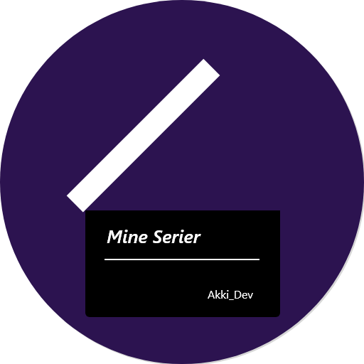

De fleste ungdommer og unge vokse bruker mye tid på å se på TV-serier enten på TV eller på streamingplattformer, men med så mange ulike plattformer er det ikke alltid like lett å holde oversikt over hvilke serier man ser på og hvor lang man har kommet på dem.

Min Serie er utviklet av meg, og prøver å løse dette problemet.

 

### How open the project-files?

Files in this folder are encrypted due to UiO rules regarding publishing of Mandatory Assignments or lacking rights to content used by the program / application. The **password** is provided in my CV (not the one on [this](https://www.akisan.ml/) website) or request it provided that you are not currently student at UiO taking any of IT-subjects. 

#### If you are running Windows:

Download all the files in a folder, and then run the .exe file to unzip the encrypted project-files.

#### If you are not using Windows:

Download 7-Zip to proceed s unzip the encrypted project-files

More on: https://github.com/Akisan98/encrypted

 

### Krav for kjøring av Applikasjonen

​	**Android SDK**

​	&nbsp;&nbsp;&nbsp;&nbsp;**Minimum** Android SDK v24 (**Android 7.0**) (Mobil som kom ut i 2016 og senere)

​	&nbsp;&nbsp;&nbsp;&nbsp;&nbsp;&nbsp;&nbsp;&nbsp;**Anbefalt** Android SDK v28 (**Android 9.0**) (Mobil som kom ut i 2018-2019 og senere)

 

​	**Android Studio**

​	&nbsp;&nbsp;&nbsp;&nbsp;**Android Studio 3.5 eller nyere**

Om du ønsker å ta en titt på appen eller Android Studio filene, er det fint om du sender meg en epost på akisan.98@gmail.com da den kun kan brukes privat (pga manglende lisenser for poster-bilde).

[Passord Beskyttet ZIP mappe med APK](https://github.com/Akisan98/min-serie/raw/master/MineSerier.zip) (Bruk 7-ZIP for å hente ut APK filen)

eller

(Litt utdaterte - men viser hovedfunksjonaliteten)

[Video Demo av App (uten lyd) - YouTube](https://youtu.be/vJYQGVUWZ_w)

[Video Demo av App (uten lyd med forklarende tekst) - YouTube](https://youtu.be/f0b8N9JT_Lo)

 

### Aktivitetene/Funksjonalitetene

Appen vil starte i fullskjermsmodus noe som går igjen i hele appen i enkelte deler er statusbaren fjernet helt mens i andre deler er den gjennomsiktig. Jeg personlig er team gestures så appen er laget slik at bunn-baren alltid er skjult frem til man swiper opp fra bunnen eller toppen. I listene vil denne forsvinne igjen etter 1,5 s.

#### Spash Screen

Har fått lagt til Spash Screen som er designet og animert i Adobe XD, og kjører i 3 sekunder før mainactivity starter (Mine Serier). Trykker man på skjermen mens den spash screen kjører vil du få en melding som spør om du er utolmodig.

#### Mine Serier ( Hovedsiden )

Her finner man alle sine serier i form av kort i en RecyclerView (Liste), som er lagret i en database slik at dataen blir persistent. Kortene har navn, bilde episodenr og sesongnr, slik at man kjapt kan finne frem til hvilken episode man var på. Men man scroller gjennom listen vil knappen nederst til høyre forsvinne slik at den ikke er i veien, og dukke opp når man ikke scroller. Trykker man på denne knappen dukker det opp en meny med alternativer for ulike måter å legge til en ny serie i listen over "Mine serier".

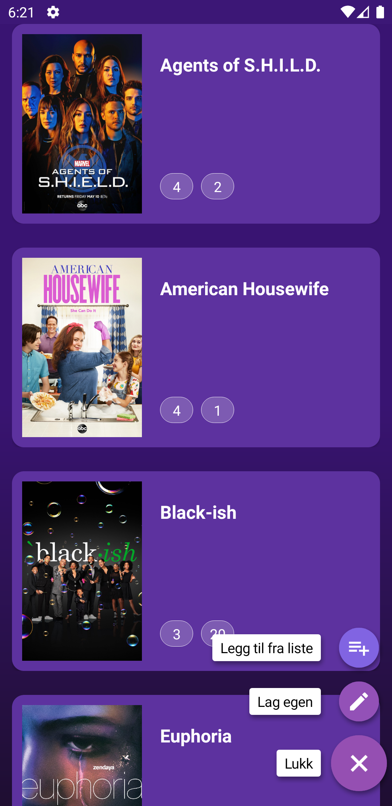

#### Serie listen ( Legg til fra liste )

På samme måte som man finner kort på Hovedsiden med bilde og tittel finner man her også, her vil også den knappen øverst til venstre forsvinne når man scroller i listen. Når man velger en serie blir du tatt med til en ny skjerm: Legg til Serie.

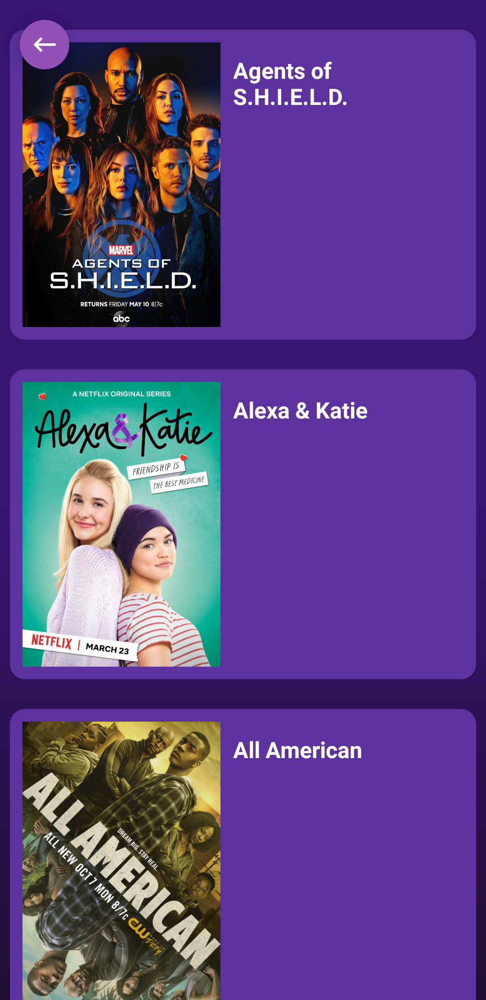

#### Legg til Serie

Når man trykket på en serie fra Serie listen vil man bli tatt med til en skjerm med tittel og bilde, hvor det også vil være to felt hvor du kan fylle inn hvilken sesong og episode du er på, har du ikke sett den fra får kan man fylle inn feks 0,0 eller 1,1 for å indikere at episode 1 er neste episode. Etter at man trykker lagre vil serien bli lagt til i Mine Serier-listen og man blir sendt tilbake til Serie listen hvor man velge å legge til flere serier eller navigere seg tilbake til Hovedskjermen.

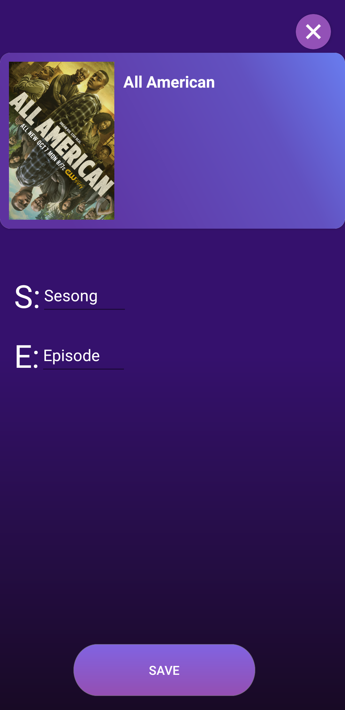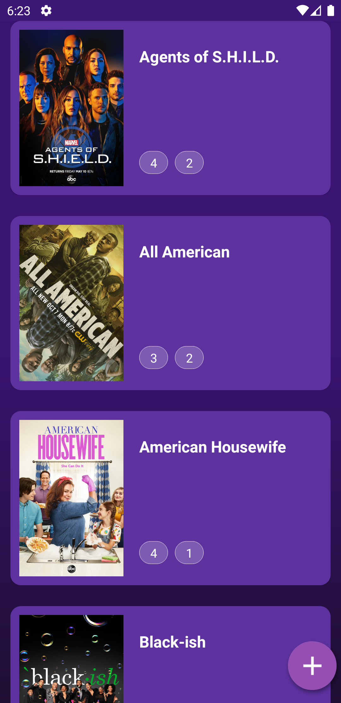

#### Legg til Serie (Manuelt)

Slik jeg nevte i delen om Hovedsiden, er det to måter å legge til serier. Tidigere måtte man fylle inn all info for hånd på denne skjermen, noe man heldigvis slipper nå. Nå holder det med at man fyller ut Sesong, Episode og gir IMDB link (PC-versjonen), om man gir mobilversjoen altså med m: https://m.imdb.com så vil appen fikse det i bakgrunnen slik at det blir https://imdb.com/... Det som skjer i bakgrunnen er at den besøker nettsiden og henter info som navn og lenke til bilde, dette vil den lagre i databasen sammen med antall sesong og episode du har sett.

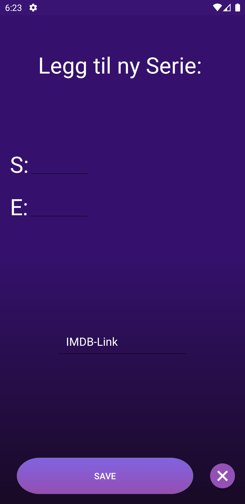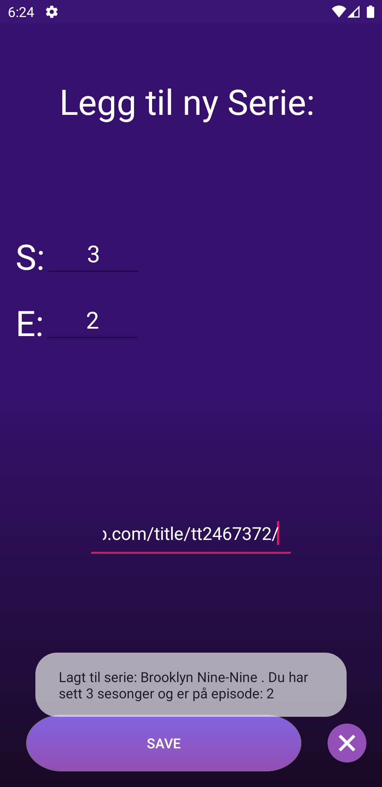

#### Serie Detailje

I Serie Detailje siden får flere alternativer som å øke antall episoder/sesonger man har sett på. Om man skulle gjøre noe feil finner det flere alternativer som man får opp ved å trykke på plus tegnet. Sletter man serien forsvinner den kun fra Min Serie listen men vil forbli i Serie listen om den finnes der. Oppdater bilde funker på samme måte som Legg til Serie (Manuelt) ved at den søker gjennom IMDB siden til den aktuelle serien og oppdaterer bilde-lenken som er i databasen.

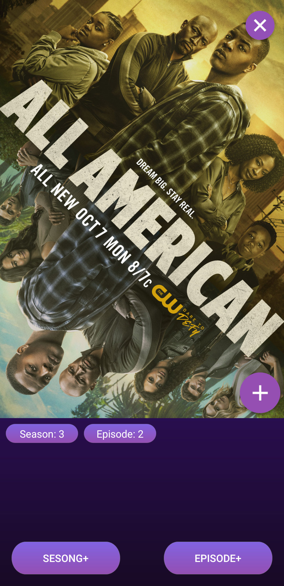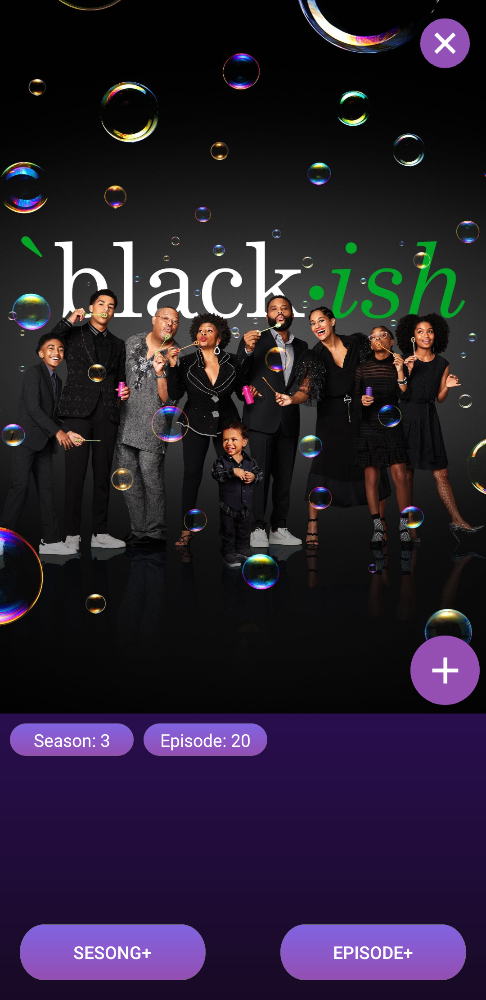

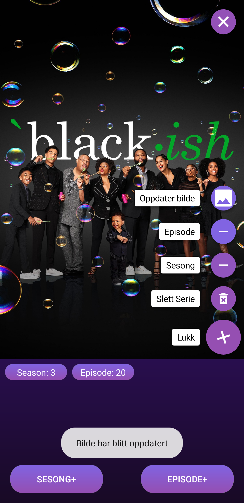

#### Metadata Screen

Denne skjermen viser litt statistikk / informasjon knyttet til denne serien, som antall sesonger og episoder man har sett og hva det tilsvarer i timer.

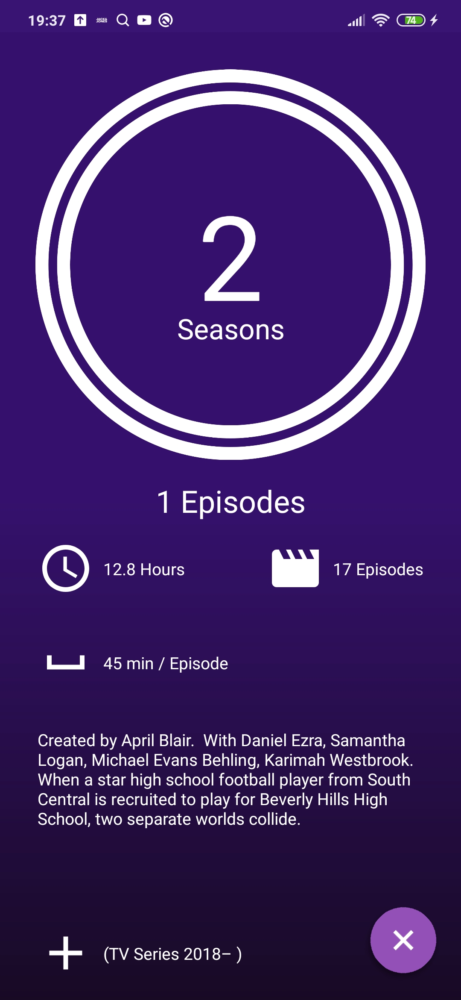

#### Total Time Screen

Denne skjermen viser litt statistikk / informasjon knyttet til alle seriene man ser på, som antall timer man brukt på seriene og hva det tilsvarer i minutter. Denne viser skjermen viser også hvor mange episoder man har sett på total fra alle seriene, og nederst vil man se en kort med den mest sette serien. 

#### Dark Mode

Jeg forsøkte meg litt med Dark Mode slik at Appen bytter farge hvis Dark Mode er aktivert i system-innstillingene. Nedenfor ser du en kort demo av Dark Mode i Total Time Screen Activity, jeg syntes den ble litt kjedelig så den er ikke aktivert/inkludert som standard for å aktivere Dark Mode må man redigere navnet på mappen "potensialDarkmode" i res til "layout-dark".

<video autoplay muted loop style="height: 85vh; padding: 0">
  <source src="video/darkDemo.mp4" type="video/mp4">
  Your browser does not support HTML5 video.
</video>

#### Biblioteker / Credits

Appen bruker Glide for å laste inn bildene fra IMDB, da denne egner seg godt for bruk i RecyclerViews.

Appen bruker FABMenu ( [android-floating-action-button](https://github.com/futuresimple/android-floating-action-button) ) biblioteket laget av Jerzy Chalupski, for å lage sammenleggbare menyer i Serie Detalje siden og i Hovedsiden

#### Nøkkelteknologi/funksjoner

- Room Database (SQL Lite)
- HTML Scraping (JSoup)
- Gilde - Bilde fra Internett
- Tråder
- Google App Backup (Tar sikkerhetskopi av brukerdata Ink. serier du legger til)
- ( Custom Layout for 16:9 og 18:9 )
- Dark Mode

#### Design

I denne appen har jeg jobbet en del med å lage et godt design som skal være lett og brukevennelig for målgrunnen (ungdom/ung voksen). Fremfor rå funksjonalitet.

Jeg har Adobe XD til å designe/velge en del av UI elementene i appen.

 

 

 

   

[Akisan (Sen Sommer - Høst 2019)](https://Akisan98.github.io)