Mist
==== 
<!---->

Mist applikasjonen er utviklet av Akisan Thiagalingam, Anders Martin Kval, Fredrik Aleksander Haugen Joakimsen, Jonas Blårud og Kenneth Bayeng Sanglay. Applikasjonen viser luftkvaliteten i norske byer på en lett og brukervennelig måte med data fra Meteorologisk institutt sitt API, den viser også annen praktiske infomasjon som været, luftfuktighet og vindhastighet.

Krav for kjøring av Applikasjonen
---------------------------------
#### Android SDK
- Minimum Android SDK v24 (Android 7.0) (Mobil som kom ut i 2016 og senere)
  - Anbefalt Android SDK v28 (Android 9.0) (Mobil som kom ut i 2018-2019 og senere)
#### Android Studio
- Android Studio 3.4 og nyere
#### Google Play Services
- Det kreves at mobilen kjører Google Play Services 16.1.0 eller nyere, som blir oppdatert gjennom Google Play Store av seg selv, siden det er essensielt for å kjøre de fleste av Google sine tjenester / applikasjoner. Trykk [**her**](https://play.google.com/store/apps/details?id=com.google.android.gms&hl=en_US "Google Play Services - Google Play Store, Åpnes i samme vindu") for å laste ned nyeste versjon av Google Play Services

[**Kjente feil**](https://akisan98.github.io/mist/#kjente-feil "Kjente feil")

<!-- Spashscreen / Loadingskjerm
---------------------------- -->
### Spashscreen / Loadingskjerm
Når man starter opp applikasjonen vil man se en spashscreen, i bakgrunnen laster applikasjonen inn luftkvalitets- og værdata fra stasjoner rundt om kring i Norge driftet gjenom MET-APIet.

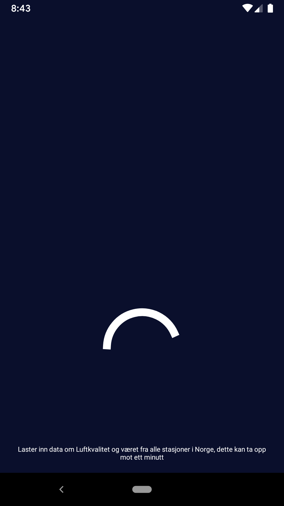

<!-- Onboarding / Velkomstskjerm
---------------------------- -->
### Onboarding / Velkomstskjerm
Første gang du starter opp applikasjonen vil det vises en introduksjon til de forskjellige elementene i applikasjonen, som forklarer brukeren om mulighetene og hva ting betyr. Hvis brukeren ønsker senere å se denne introduksjonen på nytt så kan dette aktiveres under innstillinger slik at det vises på nytt ved neste kjøring.

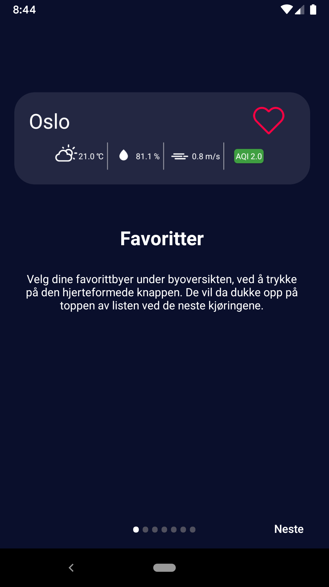 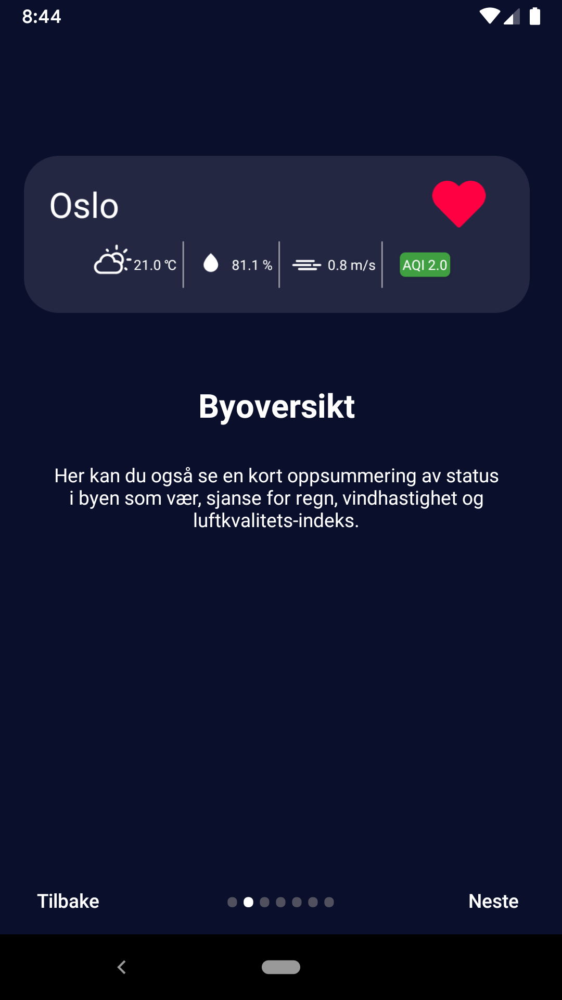 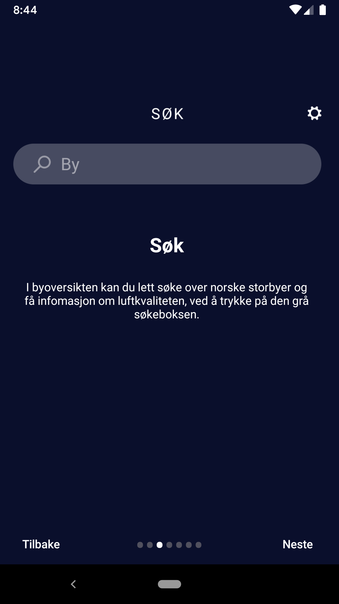 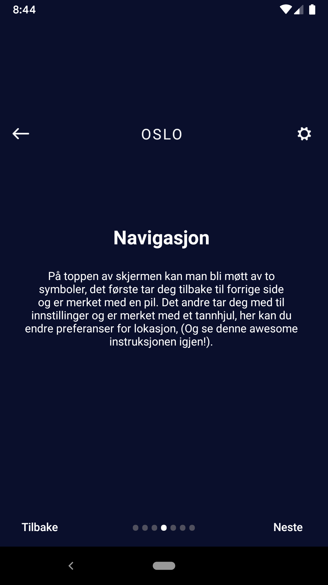 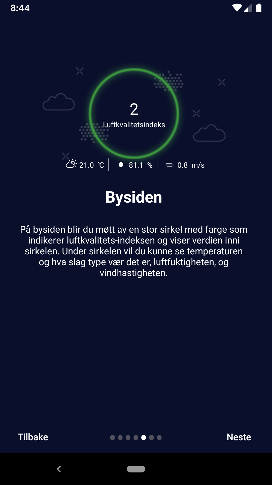 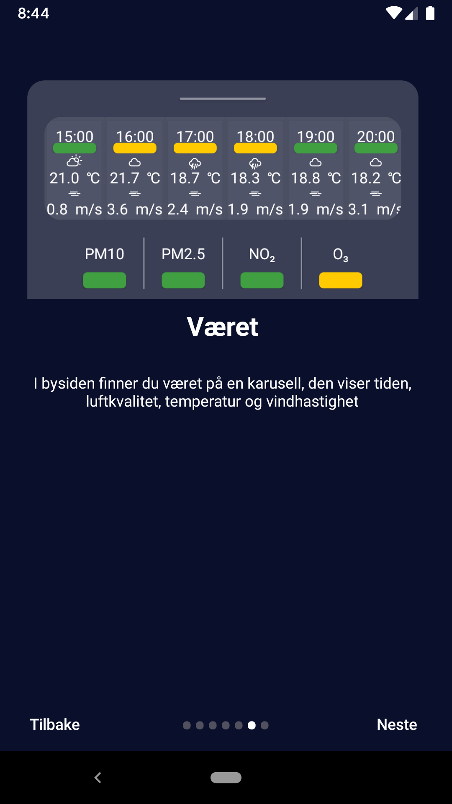 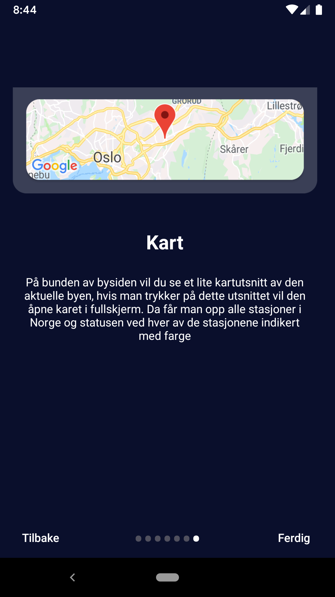

<!-- Søkeside
-------------- -->
### Søkeside
På søkesiden kan man søke etter byer i Norge og favorisere de, når man gjør det vil de dukke opp på toppen av listen ved neste kjøring. Fra søkesiden ser man infomasjon om været, luftfuktighet, vind og luftkvalitetsindeks.

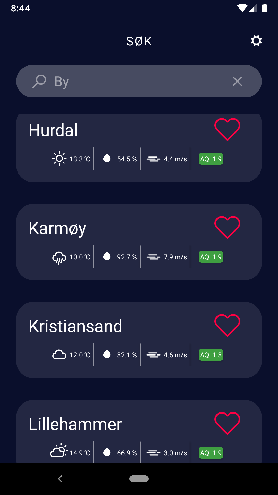 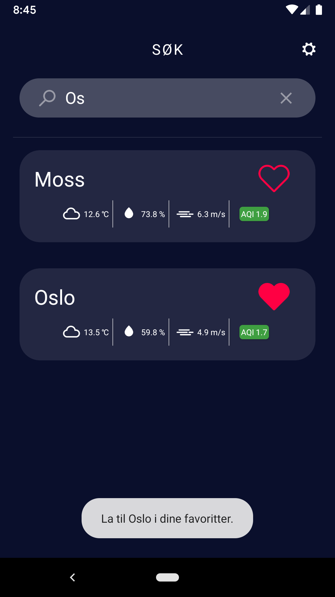

<!-- Byside
------- -->
### Byside
I bysiden har du oversikt over luftkvaliteten i den valgte byen. Midt på skjermen ser man en stor sirkel med farge som viser nåværende status og ender seg etter hvordan luftkvaliteten er. Rett under sirkelen ser man temperaturen, hvordan type vær det er, luftfuktighet og vindhastighet.

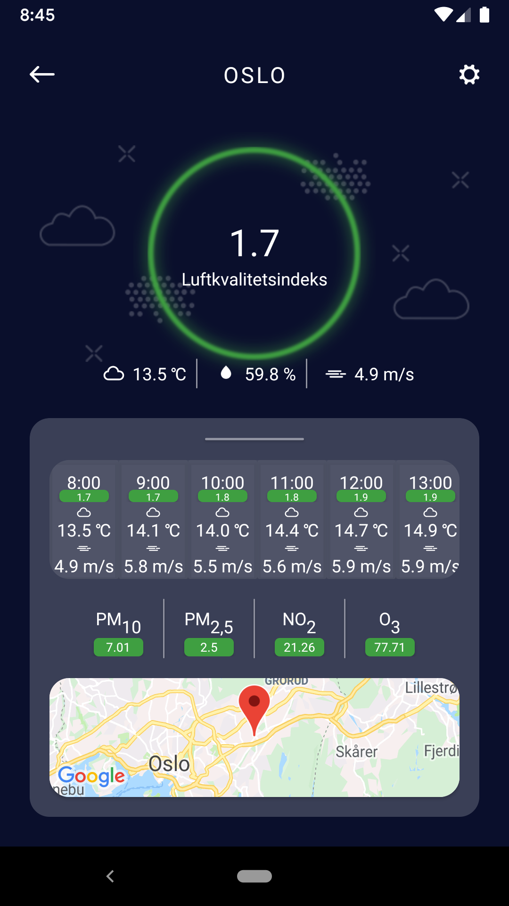 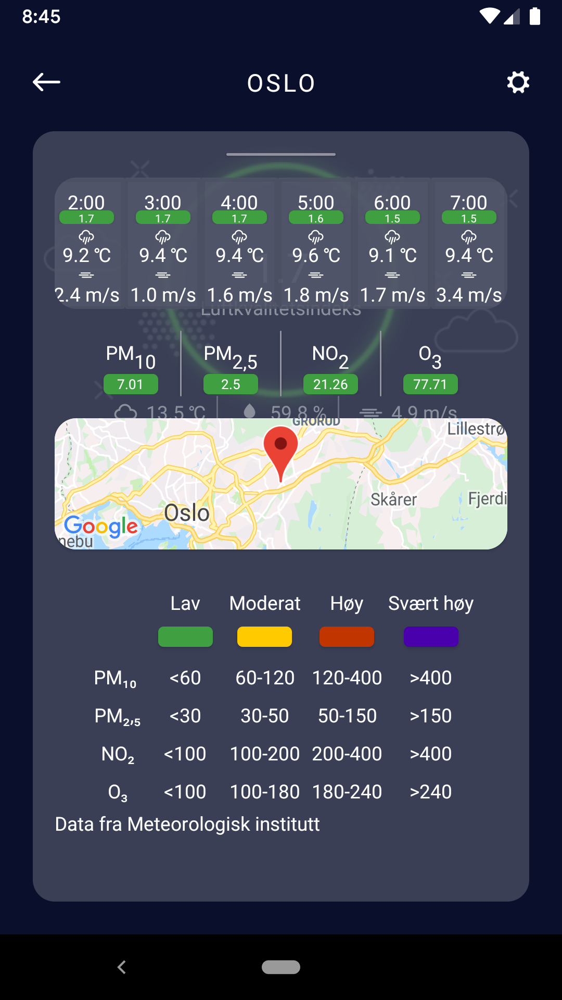

<!-- Kart
---- -->
### Kart
Fra bysiden kan man trykke på kartutsnittet som åpner kartet i fullskjerm med merkører av alle stasjoner i Norge, med statusen merkert ved at markørende og sirkelen rundt dem ender farge, mer om fargekodene kan man lese på infomasjonssiden som man kan nå ved å trykke på knappen med infomasjonsymbol. Den andre knappen sentrerer kartet over brukeres lokasjon gitt at brukeren har gitt oss tillatelse til å bruke lokasjonstjeneste. Dette kan gis og fratas under innstillinger

 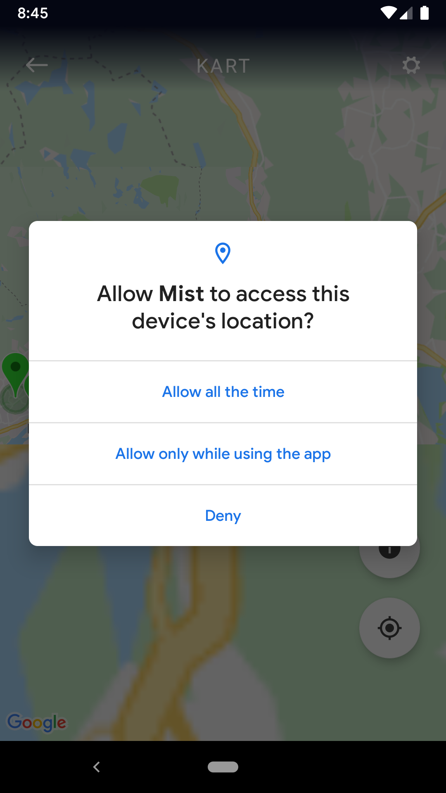 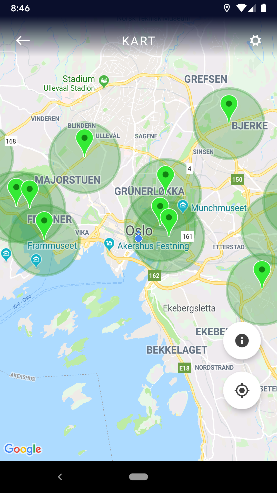

<!-- Innstillinger
------------- -->
### Innstillinger
Innstillinger kan nås fra store deler av applikasjonen vår, her kan man endre på et par ting. Hvis man ønsker å se Onboarding / Velkomstskjerm kan man huke av «Ikke vis Intro ved start», da vil den vises ved neste omstart. Under innstillinger kan man også gi eller trekke lokasjonstillatelse for applikasjonen og nytt for Android Q er at man også kan endre mellom tillatelse til å bruke lokasjon hele tiden eller kun når applikasjonen er i bruk (Foreground).

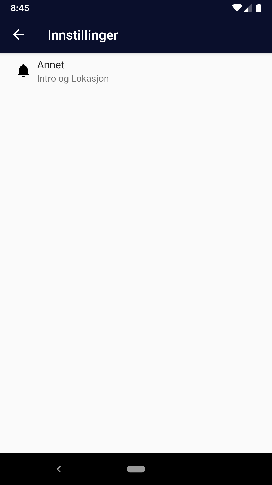 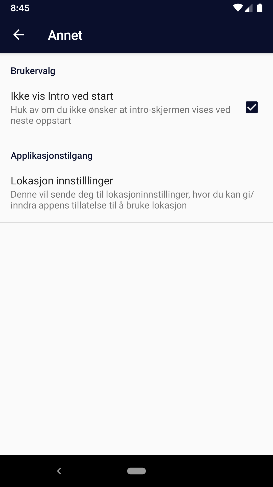

<!-- Infomasjonsskjerm
----------------- -->
### Infomasjonsskjerm
Infomasjonskjermen forklarer kort om hva de forskjellige fargene symboliser og hvilke tall vi baser oss på. 

 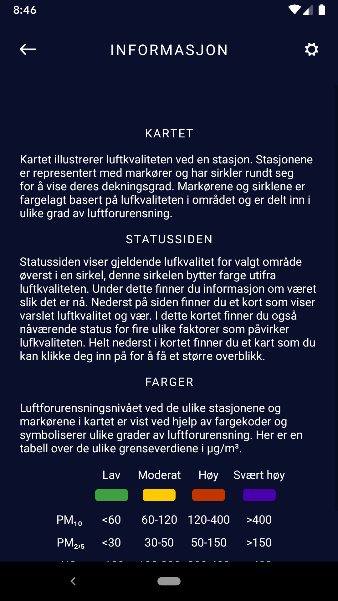 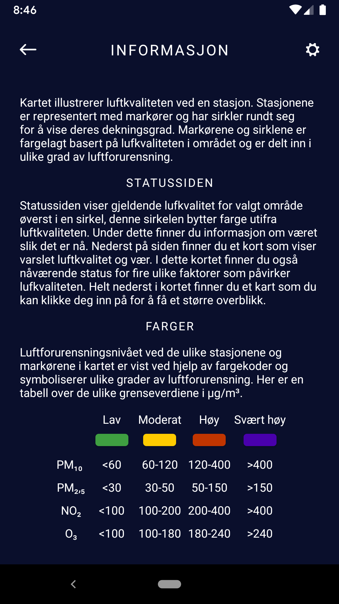

Testing av Applikasjonen
------------------------
Når vi utviklet applikasjonen testet vi den gjevelig for å se om applikasjonen oppførte seg som forventet og kunne oppdage og utbedre feil tidlig i prosjektet...

#### Mobiler Applikasjonen er testet på:
- Pixel 2 **(AVD)** (2017)
  - Android Pie (9.0)
  - Android Q (10.0)
- OnePlus 6 (2018)
  - Android Pie (9.0)
- Samsung Galaxy S9 (**Europeisk Modell**) (2018)
  - **Android Pie (9.0)**
- Samsung Galaxy S9 (**Amerikansk Modell** - Firebase Test Lab) (2018)
  - **Android Oreo (8.0)**
- Samsung Galaxy S7 (2016) **( ! )**
  - Android Oreo (8.0)
- Motorola Moto Z (**Amerikansk Modell** - Firebase Test Lab) (2016) **( ! )**
  - Android Nougat (7.0)
  

<!-- Kjente feil
----------- -->
### Kjente feil
- Under testing på Samsung Galaxy S7 ble det avdekket at når man starter applikasjon og navigerer seg inn på searchActivty / søkeside kan det ta et øyeblikk før bykortene dukker opp. Hvis man da prøver å søke eller trykke på «tøm tekst» knappen, så vil det «krasje» applikasjonen og tvinge lukking av applikasjonen. Denne feilen avhenger av mobilen bruker da enkelte telefoner vil laste denne skjermen tregere / raskere enn Samsung Galaxy S7, denne feilen var vanskelig å replikere på en OnePlus 6 siden man har under en sekund å trykke på «x» før bykortet er lastet inn ved første kjøring. Feilen ble bekreftet når vi kjørte testen på en Motorola Moto Z gjennom Firebase Test Lab, mens en [Samsung Galaxy S9 ikke møtte på feilen](https://akisan98.github.io/mist/#firebase-test-lab---samsung-galaxy-s9-amerikansk-versjon "Samsung Galaxy Firebase Test Lab")

### Firebase
<!-- -------- -->
Slik vi hadde funnet ut av tidligere oppdaget også Robo Test i Firebase Test Lab problemet rundt søkeside under en kjøring
som er beskrevet over, men under andre kjøringer som den med Samsung Galaxy S9 gikk det ubemerket.

##### Firebase Test Lab - Samsung Galaxy S9 (Amerikansk versjon)
Mobilen her viser ikke kartet riktig siden Google Play Services ikke er oppdatert til de nyeste versjonene. Mer om dette finner du her
[**her**](https://akisan98.github.io/mist/#google-play-services "Google Play Services")

Hvordan kjøre applikasjonen vår
=======================
Siden det ikke er noen ferdigkompliert fil som er signert, anbefaler vi at du bruker Android Studio versjon 3.4 og nyere for å komplilere og installlere på Virtual Phone eller på egen lokal mobil.

Android Studio
--------------

**Om du ikke har brukt GitHub med Android Studio må du laste ned Plug-in som du finner på:**

**https://git-scm.com/download/win**
(Trykk neste på alle de valgene, er ingen reklame)

#### Hvordan åpne prosjektet vårt:
1. Start Android Studio og vent til hovedmeny vises
2. Trykke på Check out project from Version Control og deretter Git
3. Lim inn følgende i URL felten: https://github.uio.no/IN2000-V19/Gruppe26.git (privat URL) og velg så hvor på datamaskinen du ønsker at filene lagres.
4. Vent til at den får lastet og bygget opp prosjektet ferdig
   - Android Studio Laster inn master by default, så om du skal endre i en annen branch:
   - Trykk på Git: master (nederst til høyere)
   - Trykk på brachen du vil jobbe på
   - Trykk på Merge into Current
   - (Krever at brachen er oppdatertet i forhold til master) 
   - **MERK: at når vi åpner proskjektet på Android Studio så henter den fra master men lager en lokal branch, så man kan jobbe i master men ikke push direkte til master bruk SLAVE eller en ny branch**
   
5. For å lagre endringer trykker man på VCS menyen og så på Commit
6. Skriv en Commit Message: Hva har du endret? Deretter trykk på Commit
6. Trykk deg så videre inn på VCS menyen og så på Git så Push, her er det anbefalt at man unngår å pushe direkte til Master.
- Du kan heller lage en ny branch ved å trykke på «: master» og gi dette en nytt navn, da vil man opprette et nytt brach med det navnet.
7. Tilslutt trykker man push og kan lukke programmet når man har fått bekrefelse på at endringen er pushet.
8. For å unngå problemer knyttet til uoppdatert build eller andre feil anbefaler vi at du sletter de lokale filene, slik at du vil måtte hente nye filer fra GitHub.

Android Mobil
--------------
Vi har testet bruk på Virtual Phones (AVD) som du finner i Android Studio, da med Pixel 2 kjørende på Android P og Q. Hvor Q hadde best ytelse men er fortsatt i **Beta** så her anbefales det å teste på begge.

#### Se oss hvilke [mobiler vi har testet](https://akisan98.github.io/mist/#mobiler-applikasjonen-er-testet-på "Hvilke mobil vi har testet på") på

Easter Egg (Pride Mode)
======================
I applikasjonen har vi en skjult Easter Egg, om du finner denne send oss en mail på akisant@uio.no
Easter Egg-et finner du på Bysiden. :wink: :wink: :wink: :wink: :wink: :wink: :wink: :wink: :wink: :wink:

